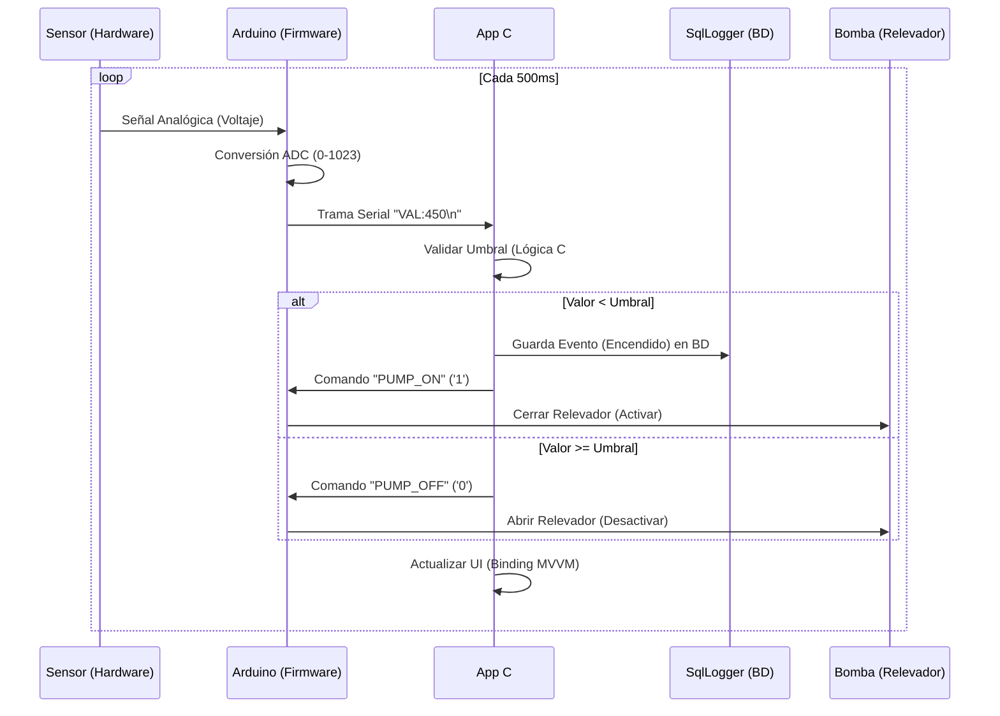
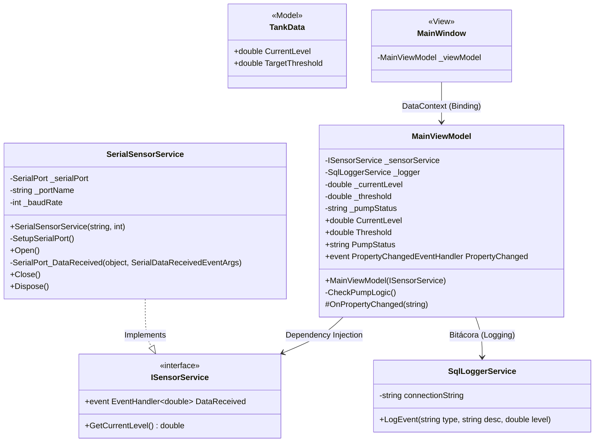
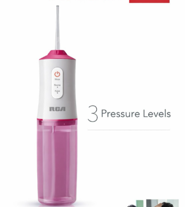
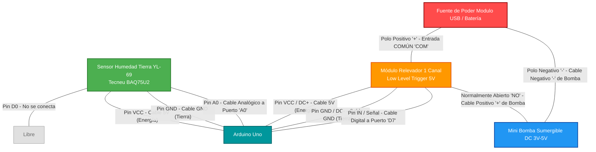

# Sistema de Monitoreo de Nivel y Control de Bomba (Telemetría de Hardware UI)

## 📖 Introducción y Guía de Despliegue (Getting Started)

Si acabas de descargar o clonar este proyecto por primera vez y no sabes por dónde comenzar, sigue esta sencilla guía paso a paso para ejecutarlo en tu computadora:

1. **Requisitos Previos:**
   - Cuentas con [Visual Studio 2022](https://visualstudio.microsoft.com/es/) instalando la carga de trabajo de *"Desarrollo de escritorio de .NET"* (WPF / WinForms).
   - Necesitas la paquetería SDK de **.NET 8** (Generalmente preincluida en VS2022).

2. **Cómo Lanzar la Aplicación:**
   - Abre la carpeta del código fuente de este proyecto en tu Explorador de Windows.
   - Encuentra el archivo **`PumpControl.sln`** y haz doble clic sobre él.
   - En Visual Studio, dale clic al botón superior central verde que dice **▶️ Iniciar** (o presiona tu botón `F5`).
   - El sistema enlazará paquetes NuGet (Como ADO.NET SQL) detrás de escena, construirá el EXE y lanzará tu panel de instrumentos MVVM al frente.

---

## 🛠️ Comportamiento del Sistema y Tolerancia a Fallos

Como este software es de instrumentación, se cuidó una arquitectura de *Manejo Asentado de Excepciones*. Es decir, el software está consciente de que no siempre tendrás todos los aparatos del ecosistema conectados a tu laptop mientras desarrollas (o vas de viaje), pero NUNCA se asustará (crasheará) cerrándose súbitamente en la cara del operador.

Analicemos cómo funciona iterando en 4 de sus posibles escenarios:

1. **Ejecución de "Solo Software" (Zero Hardware)**:
   - *Entorno:* Lanzaste WPF. Pero el cable del Arduino está lejos, y no compilaste localmente base de datos instalada.
   - *Comportamiento:* ¡WPF funcionará suavemente! Tu gráfica se quedará pausada al 0%. Ya que al fallar buscando puertos `COM3` o sentencias SQL, estos subsistemas generarán alarmas `catch` puramente silenciosas hacia la consola interna para que tú sepas el fallo pasivamente sin mermar la estabilidad interactiva de Windows.

2. **Ejecución con Arduino Solamente**:
   - *Entorno:* Enchufaste tu Arduino leyendo datos por Serial, pero omitiste configurar o instalar el pesado servidor SQL Server.
   - *Comportamiento:* Podrás subir, brincar y observar reaccionar tus gráficas `ProgressBar` de humedad o nivel al instante. Al batir tus tolerancias, lanzarás con éxito directivas mecánicas hacia tus Relevadores (Actuadores). Los intentos paralelos de documentar el suceso al motor de bases de datos simplemente fallan a puerta cerrada. ¡La máquina responde bien al terreno a pesar de ser huérfana de logs temporales!

3. **Ejecución con Base de Datos Solamente**:
   - *Entorno:* Corriste tu archivo `schema.sql` configurando una base activa pero desanclaste la placa sensorial Arduino.
   - *Comportamiento:* Las métricas permanecerán paralíticas. Al no existir tramas magnéticas alimentando el bucle desde afuera, las condicionales estáticas no estallarán ningún ciclo. El sistema jamás emitirá registros ilusorios (`INSERT`) manteniéndonos blindados ante datos polinizados por la nada misma.

4. **Producción Operativa Completa (Hard + Soft + SQL)**:
   - *Comportamiento:* Recolección viva. C# levanta y mapea cifras crudas digitales al Front, manipula órdenes relés-digitales encendiendo las válvulas in-situ para restaurar la normalidad frente a fugas y deja evidencia rastreable histórica usando conectores nativos y a prueba de intrusión (Injection-proof) a las tripas del almacenamiento masivo local.

---

## 🗂️ Arquitectura de Componentes (El Árbol de Directorios)

No se aplicó un simple *"Pon todas las reglas regadas adentro de Visual Basic"*. Para blindar la escalabilidad si crece el sistema de flotilla a decenas de gaseras, aplicamos pautas estrictas del paradigma S.O.L.I.D. y patrón clásico MVVM (Model-View-ViewModel):

- `database/` 🗄️: Exclusivo de motores relacionales. Aloja scripts de Transact-SQL como `schema.sql` requeridos por DBA's para recrear servidores desde cero.
- `arduino/` 💾: Fragmentación de Firmware en `C++` en crudo embebido y libre al control periférico mediante loops.
- **`src/` (Workspace de C# WPF):**
  - `Models/`: Las plantillas inmutables (ej. `TankData.cs`). Contenedoras torpes y vacías preparadas teóricamente para ser inundadas de los atributos propios de un concepto (Limites, Niveles).
  - `Services/`: Puertas de aduana ajenas al contexto interfaz. Aquí el `SqlLoggerService` platica de tú con tu BD local sin distracciones y el `SerialService` traduce baudios y pulsos de la USB hacia el vocabulario numérico estándar. Suelen esconderse envueltas transparentemente por interfases abstractas (por ejemplo: `ISensorService`).
  - `Converters/`: Operadores lógicos visuales puros. Dicen: *"Si el número cae por debajo de 50%, tradúcelo mágicamente en una variable llamada 'Brushes.Orange', es decir pintura Naranja"*.
  - `ViewModels/`: **El Cerebro C# (`MainViewModel.cs`)**. Amalgama todas las piezas anteriores. Importando servicios para que todo dialogue sin ensuciar la ventana. Implementa disparadores `PropertyChanged` para decirle dinámicamente a la capa de arriba *(Vista)* "¡Avisa que acabo de mover un estado!".
  - `Views/`: El escaparate cosmético (Como `MainWindow.xaml`). Declarado rígidamente solo mediante lenguajes XML que un artista plástico gráfico podría editar (Agregando sombritas, curvas o paneles de colores HTML). Dependen y confían pasiva y estrictamente vía reglas de "*Binding*" asíncrono pegado al respectivo y calculador ViewModel para moverse según el ritmo pautado.

---

## Diagramas de Arquitectura y UML (Modelo 4+1)

A continuación, se describen los modelos técnicos de la solución estructurados basándonos en Mermaid.

### 1. Diagrama de Casos de Uso (Vista de Escenarios)

*Resume las funcionalidades del sistema desde la perspectiva de los usuarios externos e internos.*

### 2. Diagrama de Secuencia (Vista Lógica)

*Detalla el ciclo de vida de los datos del sensor iterando cada 500 milisegundos.*

### 3. Diagrama de Clases (Arquitectura Estrática MVVM)

*Representa las referencias de las jerarquías asumiendo implementaciones y conectores concretos e Interfaces abstraídas dentro del proyecto.*

### 4. Diagrama de Conexiones Físicas (Cableado y Hardware)

*Especificación electrónica validada para el levantamiento físico In-Situ integrando la señalización de bajo nivel.*

**Hardware Base con Asignación de Pines (Pinout):**

- **Sensor:** Tecneu BAQ75U2 (YL-69) ➔ Señal conectada al puerto Analógico **`A0`**.
- **Actuador:** Módulo Relevador 1 Canal 5V 10A ➔ Señal conectada al puerto Digital **`D7`**.
- **Controlador:** Arduino Uno R3.
- **Bomba:** Mini Bomba Sumergible DC 3V - 5V.

    
  
  

---

## 🧪 Pruebas Manuales de Hardware (Monitor Serie)

Si deseas probar que tu placa y tus componentes responden bien sin abrir la aplicación de C# WPF, puedes apoyarte del **Monitor Serie** incluido en el IDE de Arduino (configúralo a `9600 baudios`).

**¿Qué deberías ver?**

1. **Lecturas del Sensor:** Al abrir el puerto, empezarás a ver números bajando en cascada y de forma constante en la pantalla. Esos son los valores de humedad.
   - Si dejas el sensor en reposo **al aire libre**, el número leído debería estar **cerca de 1023**.
   - Si tocas las dos patas del sensor con tu **mano húmeda** o lo sumerges parcialmente en agua, el número de resistencia **bajará rápidamente** (generalmente arrojando valores entre 200 y 400 dependiendo de tu agua).

2. **Accionar la Bomba Manualmente:**
   En la barra de envío (arriba de tu Monitor Serie), puedes escribir comandos para manipular el módulo del relevador a voluntad:
   - Envía un **`1`** y presiona Enter ➔ El relevador hará "clic", dejando pasar la corriente y **se activará la bomba**.
   - Envía un **`0`** y presiona Enter ➔ El relevador hará "clic" abriendo el circuito y **se apagará la bomba**.

---

## Trabajos Futuros (Nice to Have) / Cosas por Hacer

Para lograr que este proyecto transicione satisfactoriamente de un prototipo de simulación hacia una telemetría robusta presencial (Entornos GasLP):

- [ ] **Sensor IMU (Acelerómetro XYZ y Giroscopio):** Medir aceleración para evaluar dinámicamente comportamientos atípicos en resonancias, desgaste y desbalance de tuberías (Mantenimiento Predictivo In-Situ).
- [ ] **Micrófono Ultrasónico:** Dispositivo para el hallazgo precoz de fisuras a frecuencias en tuberías por encima de espectros audibles sin mermas invasivas de hardware.
- [ ] **Sensor Pasivo (Efecto Hall):** Utilizado de forma magnética para convertir en C# las variaciones inofensivas de un indicador de aguja nativo de la carcasa. Esto para aislar chispa, asegurando lecturas en voltajes ADC completamente galvánicamente seguras.
