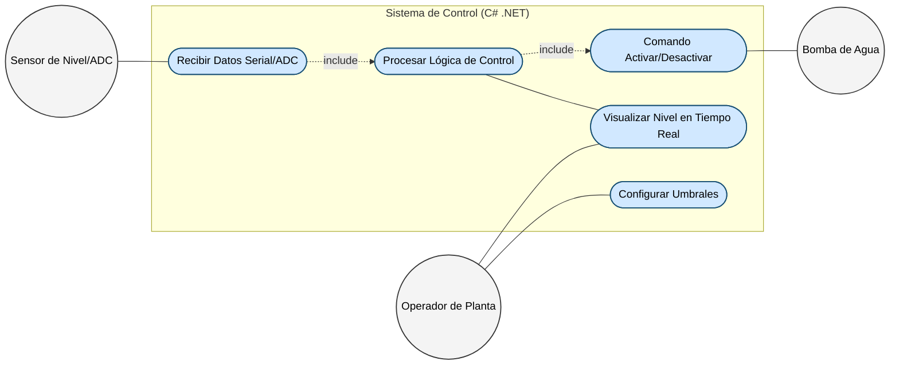
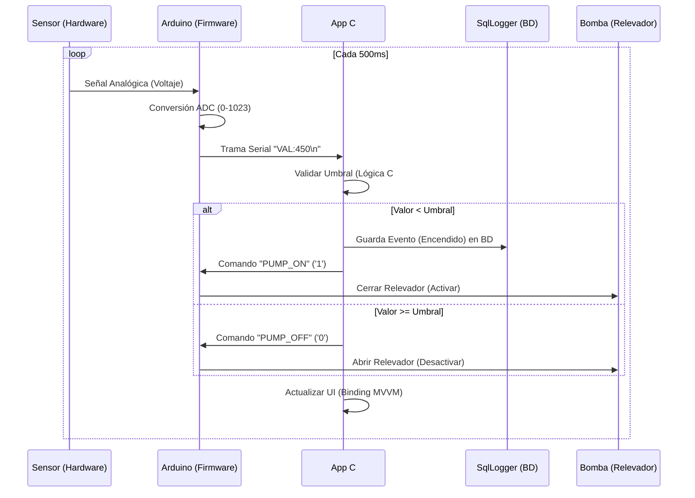

# Sistema de Monitoreo de Nivel y Control de Bomba con Arduino + C# WPF (MVVM)

## Explicación General del Sistema
Este proyecto es un **Producto Mínimo Viable (MVP)** diseñado para representar una solución industrial que automatiza el llenado y monitoreo de tanques (orientado al sector Gas LP e industrial). La solución se basa en una arquitectura de telemetría dividida en dos grandes capas operativas enfocadas en escalabilidad y robustez:

1. **El Hardware (Edge / Firmware):** Un microcontrolador Arduino lee datos instrumentales del mundo físico en tiempo real (vía un ADC conectado a un sensor) y procesa operaciones mecánicas accionando un relevador. Actúa como el dispositivo de medición en sitio (In-Situ) y envía la información telemétrica continuamente.
2. **El Software (C# / WPF .NET):** Construida utilizando Windows Presentation Foundation bajo el patrón arquitectónico MVVM (Model-View-ViewModel). Funciona como el centro de monitoreo (HMI/Dashboard). Gracias al desacoplamiento, mantiene la lectura asíncrona del puerto serial fluida sin congelar la ventana del usuario. Cuenta con integración abstracta a bases de datos mediante SQL Server para formar una bitácora de eventos y auditoría de lecturas (Logging).

---

## Diagramas de Arquitectura (UML / Modelo 4+1)

A continuación, se describen los modelos técnicos de la solución orientados a los estándares de desarrollo robusto.

### 1. Diagrama de Casos de Uso (Vista de Escenarios)
*Resume las funcionalidades del sistema desde la perspectiva de los usuarios externos e internos. Se ilustra a un "Operador de Planta" como el encargado humano de definir parámetros limite, mientras el "Sensor de Nivel" y la "Bomba" actúan como agentes de origen sistémico de los cuales recibimos e instruimos información.*

### 2. Diagrama de Secuencia (Vista Lógica)
*Detalla el ciclo de vida de los datos a lo largo del tiempo. Cada iteración muestra cómo la lectura magnética/analógica del hardware es digitalizada mediante ADC, enviada a C# a través de serial, validada según el patrón MVVM y evaluada lógicamente. Dependiendo de los setpoints dictados por el usuario, emite tramas actuadoras y de forma asíncrona salva registros persistentes a bases de datos relacionales (Audit Trail).*

### 3. Diagrama de Clases (Arquitectura MVVM)
*Representa la estructura estática orientada a objetos usando S.O.L.I.D. Destaca la abstracción `ISensorService` que blinda el ViewModel para que las pruebas unitarias y el recambio de periféricos sean agnósticos. Incluye ahora la inyección teórica del `SqlLoggerService` para propósitos de respaldo.*

```mermaid
classDiagram
    class ISensorService {
        <<interface>>
        +event EventHandler~double~ DataReceived
        +GetCurrentLevel() double
    }

    class SerialSensorService {
        -SerialPort _serialPort
        -string _portName
        -int _baudRate
        +SerialSensorService(string, int)
        -SetupSerialPort()
        +Open()
        -SerialPort_DataReceived(object, SerialDataReceivedEventArgs)
        +Close()
        +Dispose()
    }

    class SqlLoggerService {
        -string connectionString
        +LogEvent(string type, string desc, double level)
    }

    class MainViewModel {
        -ISensorService _sensorService
        -SqlLoggerService _logger
        -double _currentLevel
        -double _threshold
        -string _pumpStatus
        +double CurrentLevel
        +double Threshold
        +string PumpStatus
        +MainViewModel(ISensorService)
        -CheckPumpLogic()
        +event PropertyChangedEventHandler PropertyChanged
        #OnPropertyChanged(string)
    }

    class TankData {
        <<Model>>
        +double CurrentLevel
        +double TargetThreshold
    }

    class MainWindow {
        <<View>>
        -MainViewModel _viewModel
    }

    SerialSensorService ..|> ISensorService : Implements
    MainViewModel --> ISensorService : Dependency Injection
    MainViewModel --> SqlLoggerService : Bitácora (Logging)
    MainWindow --> MainViewModel : DataContext (Binding)
```

---

## Especificaciones de Hardware Actual (Sensor)

Actualmente, el sistema utiliza un sensor estándar de contacto para comprobar la lectura analógica de porcentaje frente al problema simulado.

- **Fabricante:** Tecneu (Número de parte/Modelo: BAQ75U2)
- **ID Comercial:** ASIN B0BBQ7DTW6
- **Dimensiones:** 36 mm x 9 mm x 10 mm
- **Peso:** 20 g
- **Alimentación:** Corriente Continua (CC), sin necesidad de baterías.
- **Detalles físicos:** Color multicolor.

## Trabajos Futuros (Nice to Have) / Cosas por Hacer

Para lograr que este proyecto transicione satisfactoriamente de un prototipo de escritorio o simulador funcional hacia un sistema de telemetría industrial de gas, deberíamos enfocar el hardware sumando los siguientes elementos:

- [ ] **Sensor IMU (Acelerómetro XYZ y Giroscopio):** Acoplar dispositivos que evalúen la vibración estructural de motores y tuberías. En instrumentación, correlacionar la aceleración con las frecuencias de una bomba y sus tuberías permite evaluar su **estado de salud**, identificando si los rodamientos fallan o existe resonancia y comportamiento anómalo.
- [ ] **Micrófono Ultrasónico:** Dispositivo de monitoreo de sonido en alta frecuencia diseñado específicamente para encontrar y aislar de manera anticipada posibles microfugas en bridas y tuberías de alimentación de gas.
- [ ] **Medición No Invasiva mediante Efecto Hall:** Una medición invasiva (perforar/contacto) en un tanque de gas es peligrosa. La mayoría de estos tanques tienen un reloj/indicador flotante analógico, cuyo flotador interno asciende acoplado a un imán. La propuesta definitiva es usar un **sensor de Efecto Hall** fijo frente al cristal de este indicador. Así, se recoge la fluctuación de este campo magnético (asociada al ascenso del flotador) y el efecto se encarga de convertir de manera pasiva y segura la fuerza del imán en un diferencial de voltaje legible por el Arduino. Mismo resultado, con nulo riesgo de chispa.
