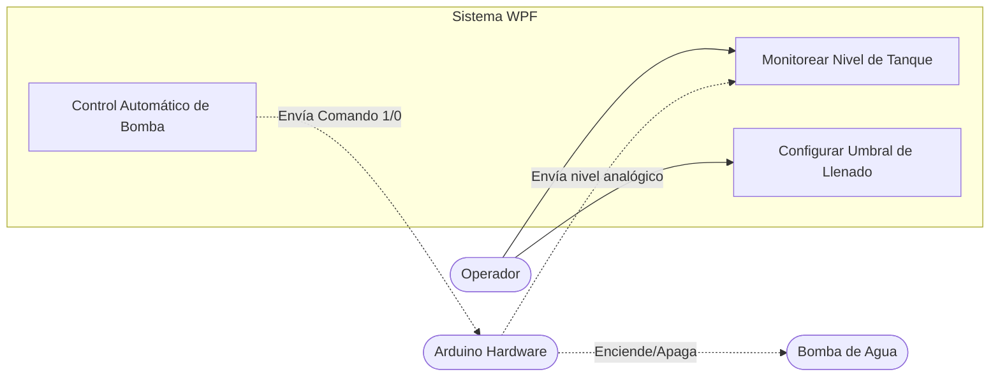
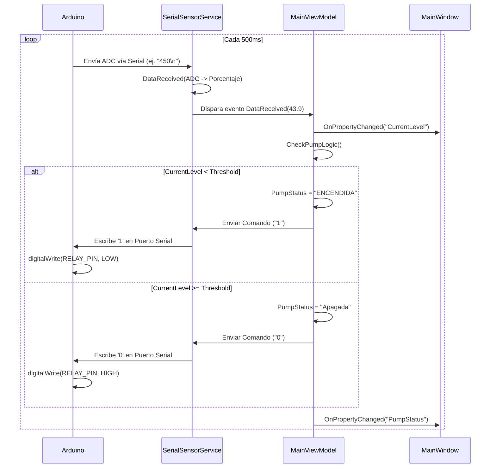
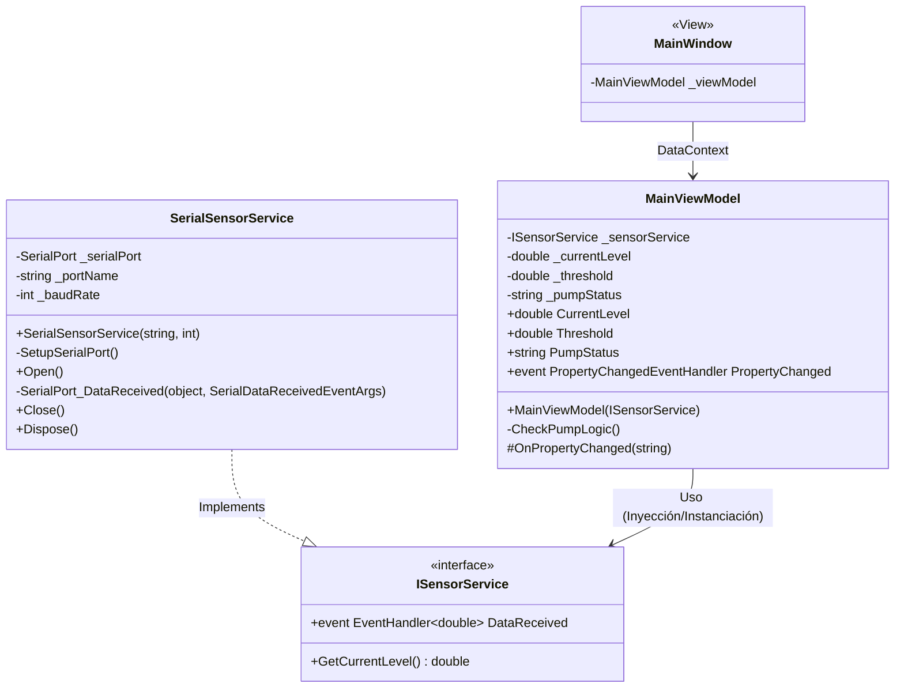

# pump-level-control-wpf
Control Nivel GUI

Proyecto que implementa un sistema para monitoreo de nivel y control de una bomba, separando la interfaz de usuario en WPF (Windows Presentation Foundation) bajo el patrón MVVM, y el mundo físico controlado mediante un Arduino conectado por puerto Serial.

## Diagramas del Sistema

En el directorio `docs/` se encuentran los diagramas de la arquitectura documentados como código, utilizando formato [Mermaid](https://mermaid.js.org/).

### 1. Diagrama de Casos de Uso
*(Fuente: `docs/use-case.mmd`)*

### 2. Diagrama de Secuencia 
*(Fuente: `docs/sequence.mmd`)*

### 3. Diagrama de Clases (Arquitectura MVVM)
*(Fuente: `docs/class-diagram.mmd`)*

## Especificaciones de Hardware Actual (Sensor)

Actualmente, el sistema utiliza un sensor estándar de contacto para comprobar la lectura analógica de porcentaje frente al problema simulado.

- **Fabricante:** Tecneu (Número de parte/Modelo: BAQ75U2)
- **ID Comercial:** ASIN B0BBQ7DTW6
- **Dimensiones:** 36 mm x 9 mm x 10 mm
- **Peso:** 20 g
- **Alimentación:** Corriente Continua (CC), sin necesidad de baterías.
- **Detalles físicos:** Color multicolor.

## Trabajos Futuros (Nice to Have) / Cosas por Hacer

Para lograr que este proyecto transicione satisfactoriamente de un prototipo de escritorio o simulador funcional hacia un sistema de telemetría industrial de gas, deberíamos enfocar el hardware sumando los siguientes elementos:

- [ ] **Sensor IMU (Acelerómetro XYZ y Giroscopio):** Acoplar dispositivos que evalúen la vibración estructural de motores y tuberías. En instrumentación, correlacionar la aceleración con las frecuencias de una bomba y sus tuberías permite evaluar su **estado de salud**, identificando si los rodamientos fallan o existe resonancia y comportamiento anómalo.
- [ ] **Micrófono Ultrasónico:** Dispositivo de monitoreo de sonido en alta frecuencia diseñado específicamente para encontrar y aislar de manera anticipada posibles microfugas en bridas y tuberías de alimentación de gas.
- [ ] **Medición No Invasiva mediante Efecto Hall:** Una medición invasiva (perforar/contacto) en un tanque de gas es peligrosa. La mayoría de estos tanques tienen un reloj/indicador flotante analógico, cuyo flotador interno asciende acoplado a un imán. La propuesta definitiva es usar un **sensor de Efecto Hall** fijo frente al cristal de este indicador. Así, se recoge la fluctuación de este campo magnético (asociada al ascenso del flotador) y el efecto se encarga de convertir de manera pasiva y segura la fuerza del imán en un diferencial de voltaje legible por el Arduino. Mismo resultado, con nulo riesgo de chispa.
